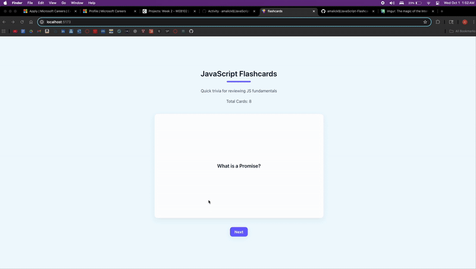

# 📚 JavaScript Flashcards - Part 2

An interactive flashcards web app built with **React + Vite** for studying JavaScript fundamentals.  
Users can enter their guesses, get feedback, and navigate through cards sequentially.

---

## 🖼️ Preview

Below is a short GIF walkthrough showing the app in action:



---

## 🚀 Features

### Core Features
- **Input-based Learning**: Enter your guess before seeing the answer
- **Answer Validation**: Get immediate feedback on correct/incorrect answers
- **Sequential Navigation**: Move forward and backward through cards in order
- **Visual Feedback**: Cards and messages change color based on answer correctness
- **Smart Answer Matching**: Flexible matching ignores case, punctuation, and partial answers

### UI/UX Features
- Displays **title**, **description**, and **total number of cards**
- Modern card flip animations with 3D perspective
- Responsive design that works on mobile devices
- Clear navigation controls with disabled states at boundaries
- Card counter showing current position (e.g., "3 / 8")

---

## ✅ Requirements Checklist

### Part 1 Requirements
- [x] Title of card set is displayed  
- [x] Short description is displayed  
- [x] Total number of cards is displayed  
- [x] Cards stored as an array of question/answer pairs  
- [x] Only one card shows at a time  
- [x] Clicking card flips between front and back  

### Part 2 Requirements (NEW!)
- [x] **Input box with submit button** for user guesses
- [x] **Visual feedback** for correct answers (green border/message)
- [x] **Visual feedback** for incorrect answers (red border/message)
- [x] **Forward/Next button** navigates to next card in sequence
- [x] **Previous/Back button** navigates to previous card in sequence
- [x] **Navigation boundaries** - buttons disabled at start/end (no wrap-around)

### Stretch Features
- [x] **Flexible answer matching** - ignores case, punctuation, partial matches
- [ ] Shuffle button to randomize card order
- [ ] Streak counter for correct/incorrect answers
- [ ] Master card functionality to remove cards from pool  

---

## 🛠️ Installation & Setup
Clone the repo:
```bash
git clone https://github.com/amalick8/JavaScript-Flashcards.git
cd JavaScript-Flashcards
